# InstaGuard - Complete Architecture Flowchart

## 1. System Overview

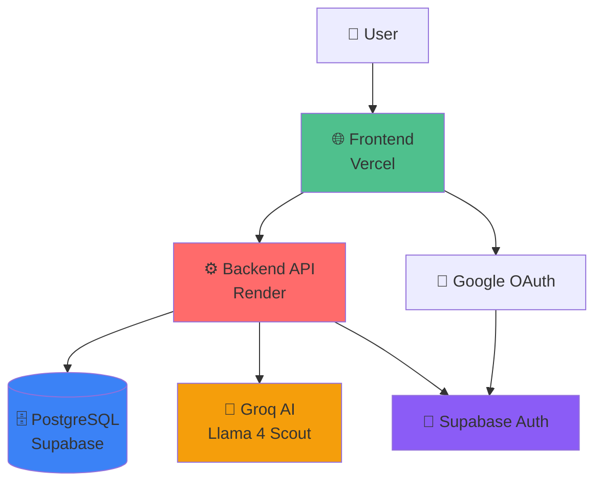

---

## 2. User Authentication Flow

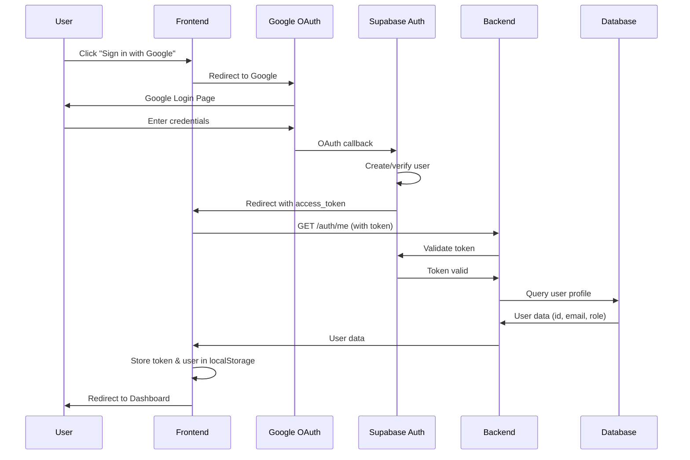

---

## 3. Image Analysis Flow

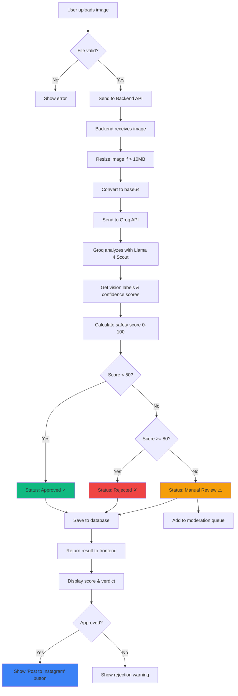

---

## 4. Feed Analysis Flow

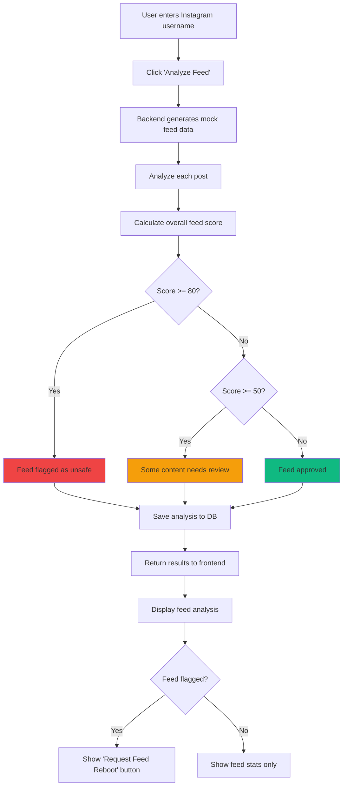

---

## 5. Feed Reboot Request Flow

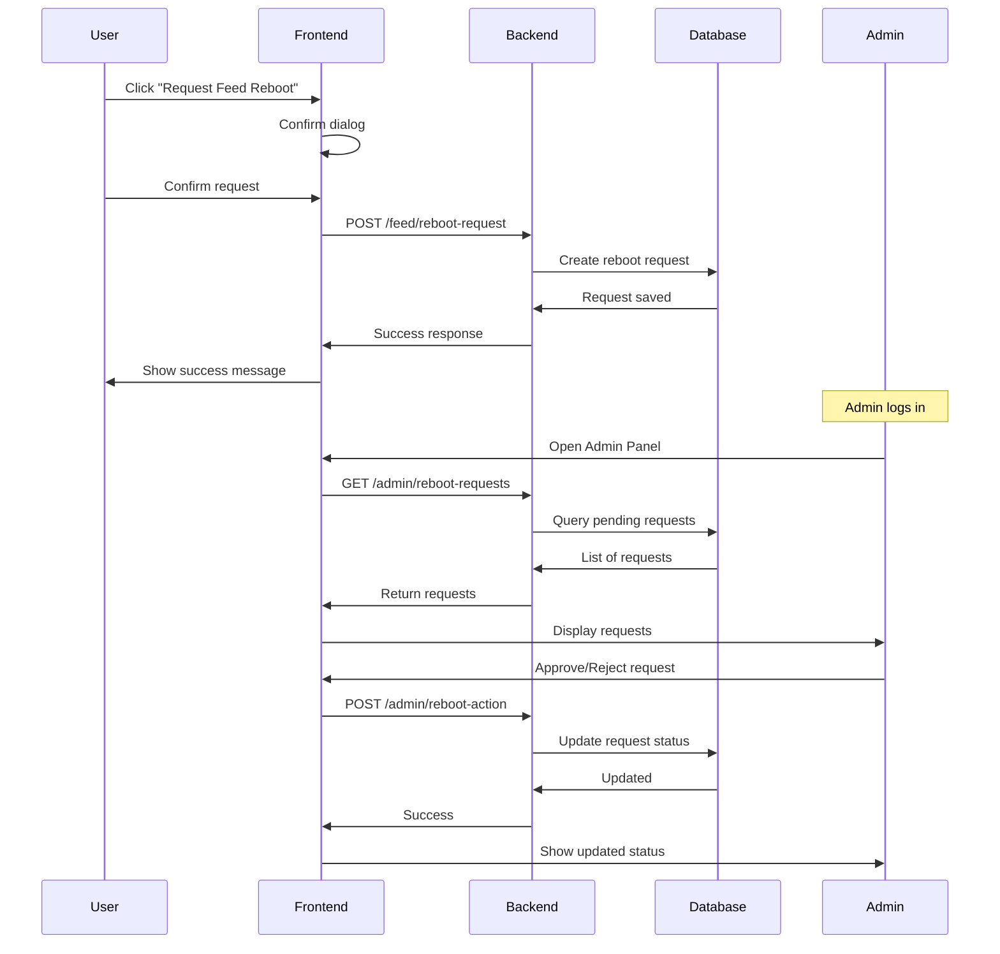

---

## 6. Admin Moderation Flow

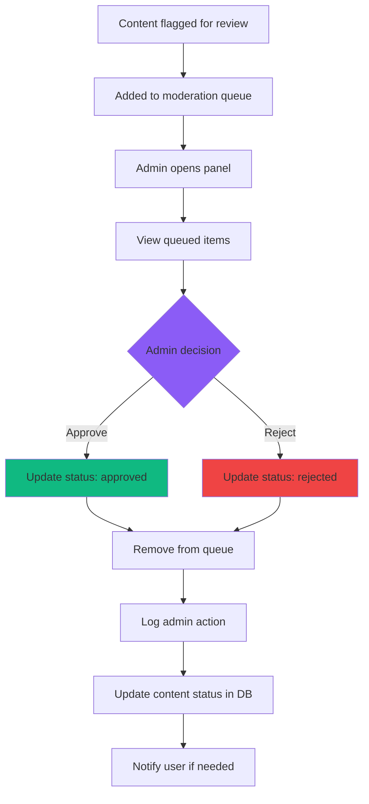

---

## 7. Dashboard Data Flow

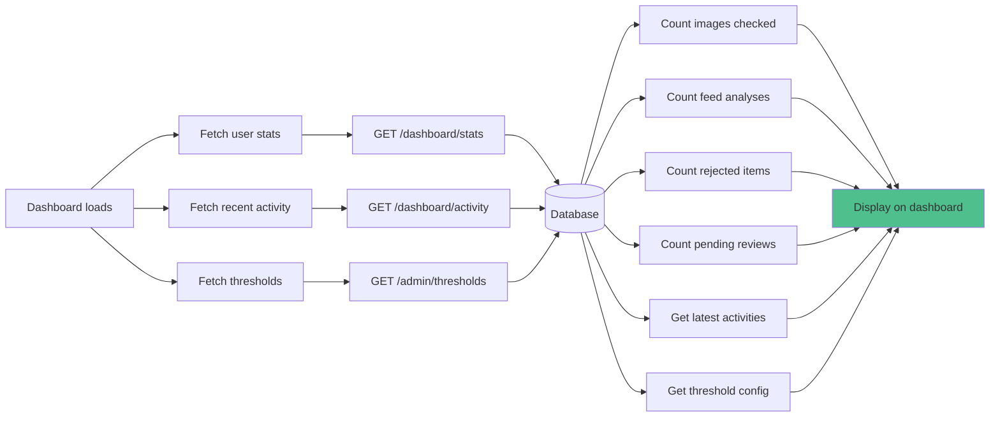

---

## 8. Database Schema Relationships

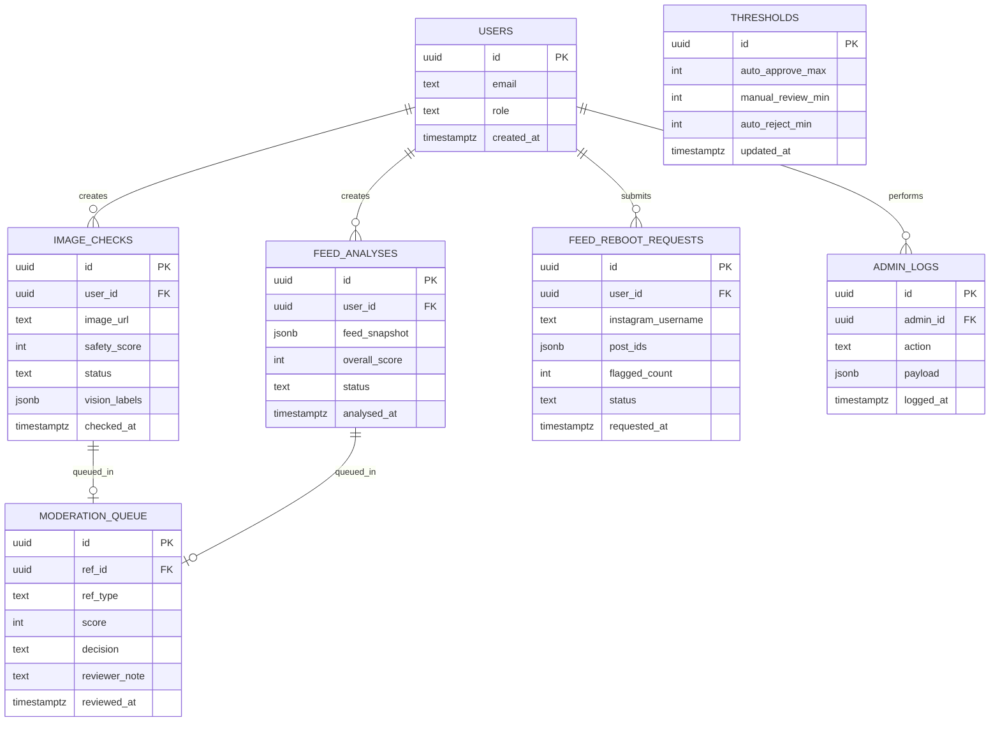

---

## 9. API Endpoint Map

```mermaid
graph TB
    API[InstaGuard API] --> AUTH[/auth]
    API --> IMAGES[/images]
    API --> FEED[/feed]
    API --> DASHBOARD[/dashboard]
    API --> ADMIN[/admin]
    
    AUTH --> A1[POST /signup]
    AUTH --> A2[POST /login]
    AUTH --> A3[GET /me]
    
    IMAGES --> I1[POST /check]
    IMAGES --> I2[GET /history]
    
    FEED --> F1[POST /analyze]
    FEED --> F2[GET /history]
    FEED --> F3[POST /reboot-request]
    
    DASHBOARD --> D1[GET /stats]
    DASHBOARD --> D2[GET /activity]
    
    ADMIN --> AD1[GET /queue]
    ADMIN --> AD2[POST /review]
    ADMIN --> AD3[GET /thresholds]
    ADMIN --> AD4[PUT /thresholds]
    ADMIN --> AD5[GET /reboot-requests]
    ADMIN --> AD6[POST /reboot-action]
    
    style AUTH fill:#8B5CF6
    style IMAGES fill:#3B82F6
    style FEED fill:#10B981
    style DASHBOARD fill:#F59E0B
    style ADMIN fill:#EF4444
```

---

## 10. Deployment Architecture

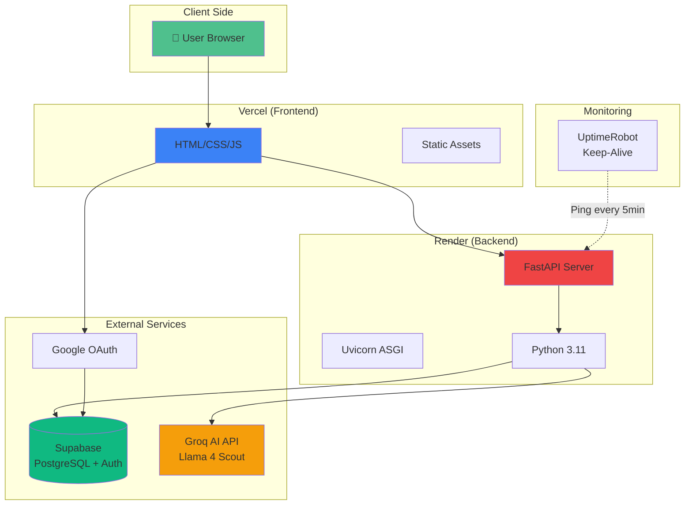

---

## 11. Security Flow

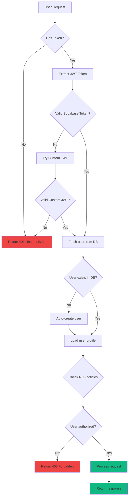

---

## 12. Error Handling Flow

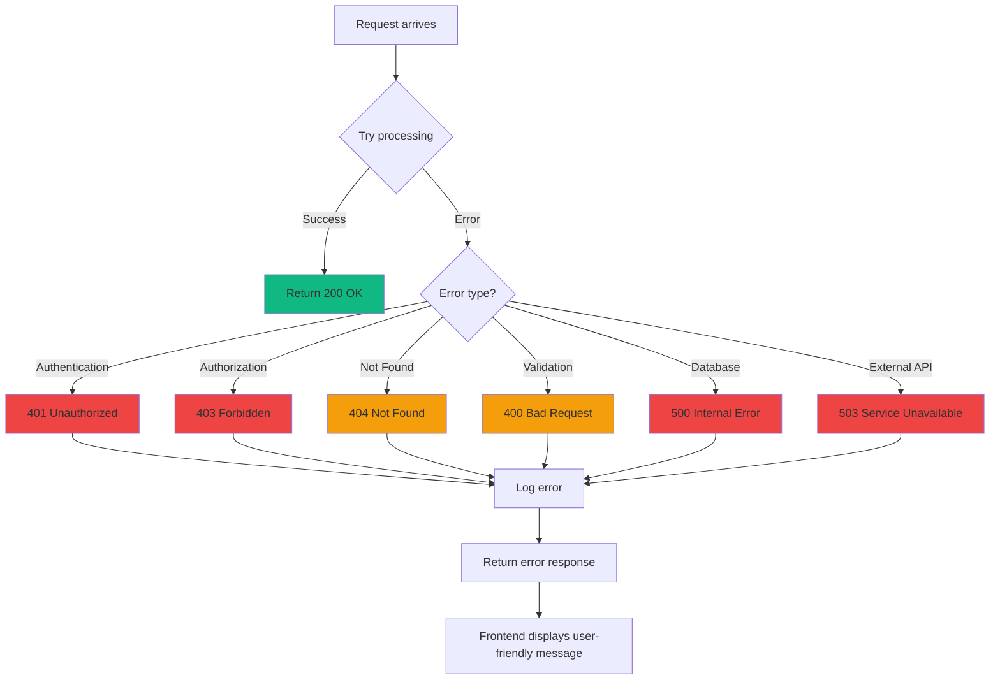

---

## 13. Keep-Alive System

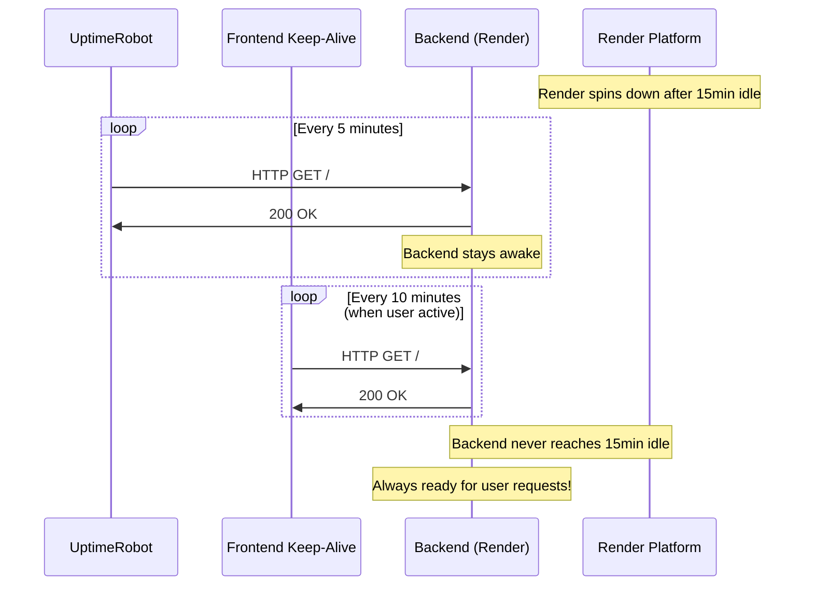

---

## How to View These Flowcharts

### Option 1: GitHub (Recommended)
1. Push this file to GitHub
2. View it directly - GitHub renders Mermaid diagrams automatically!

### Option 2: Online Mermaid Editor
1. Go to: https://mermaid.live
2. Copy/paste any diagram code
3. Download as PNG/SVG

### Option 3: VS Code
1. Install "Markdown Preview Mermaid Support" extension
2. Open this file
3. Click "Preview" button

### Option 4: Export as Images
Use Mermaid CLI:
```bash
npm install -g @mermaid-js/mermaid-cli
mmdc -i ARCHITECTURE_FLOWCHART.md -o flowchart.png
```

---

## Legend

- 🟢 Green: Success/Approved states
- 🔴 Red: Error/Rejected states
- 🟡 Yellow: Warning/Review states
- 🔵 Blue: Process/Action states
- 🟣 Purple: Authentication/Security

---

**Created for InstaGuard - AI-Powered Content Safety Platform**
